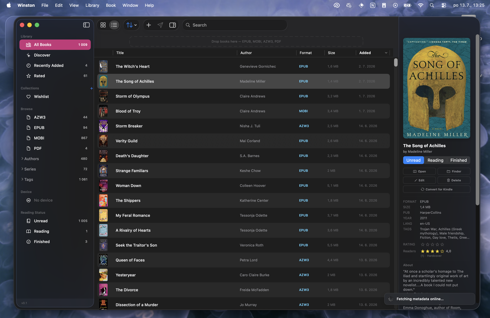
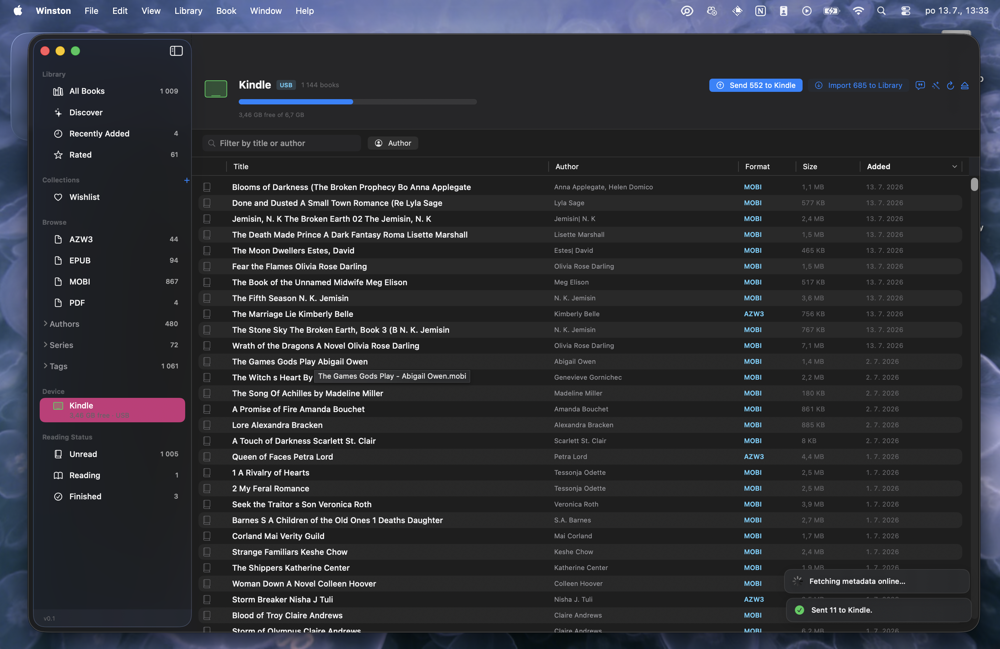
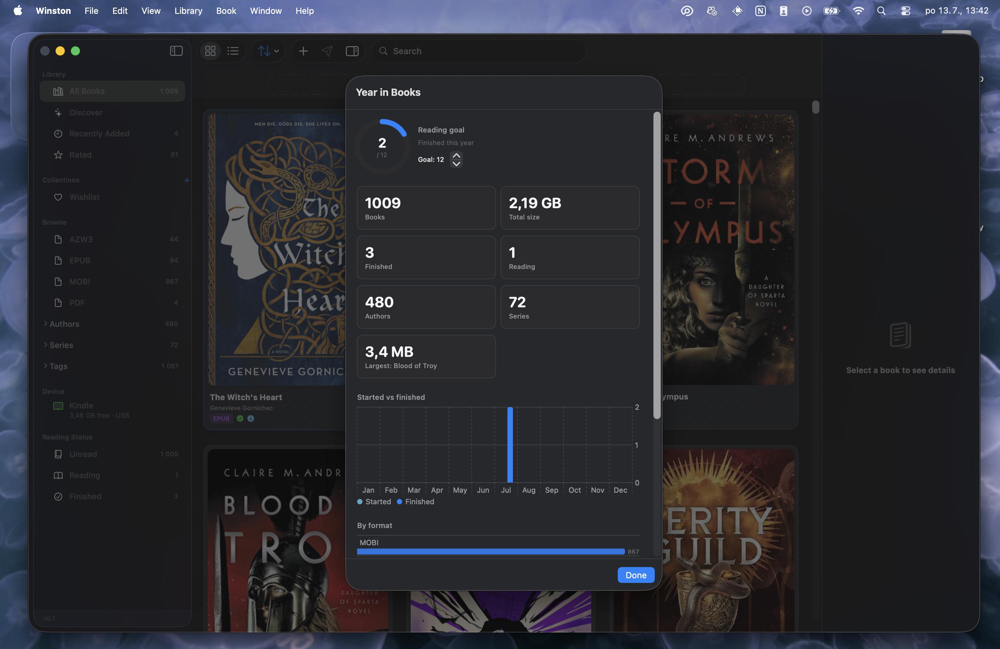
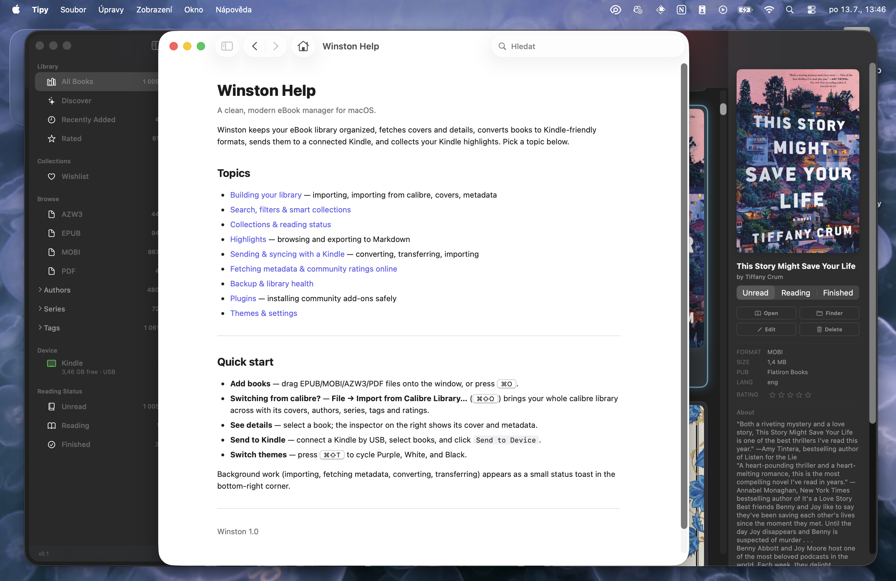

<div align="center">


# Winston

### *Two plus two still make four.* <sup>[?](https://en.wikipedia.org/wiki/2_%2B_2_%3D_5 "Freedom is the freedom to say that two plus two make four. (Winston Smith, Nineteen Eighty-Four)")</sup>

**Your books, on your Mac, on your Kindle. Nobody else in the room.**

<sub>7 MB download · zero dependencies · zero network calls · one cable</sub>

[Download](https://github.com/Aletheie/Winston/releases) · [What it does](#what-it-does) · [Where it's going](#where-its-going) · [Build it](#build-from-source)

<p>


</p>

https://github.com/user-attachments/assets/488cb698-cd61-4d0a-9fb2-f569d8ae6b86
</div>

> [!IMPORTANT]
> Winston is **early access**. It runs my whole library every day, but it is a 0.x for a reason: things still move, and the best parts are still being built. If something breaks, [tell me](https://github.com/Aletheie/Winston/issues).

## Not another Calibre

Calibre is a warehouse with every tool ever made in it. Winston is a Mac app with one opinion: the painful parts of owning ebooks should just work. So it ships its own conversion engine instead of wrapping somebody else's, treats the Kindle as a device instead of a folder, and makes zero network calls until you say otherwise.

The longer bet: a library that understands **books, not files**. Two translations of Dune are not duplicates. A fixed EPUB is not a new book. That model is where Winston is headed, one release at a time.

## What it does

The short version: everything that has to happen between a folder full of EPUBs and a book open in your hands.

## Ships its own conversion engine

The 7 MB download contains a complete EPUB to MOBI converter, written from scratch for this app. Not a Calibre wrapper, not a bundled binary. It splits Czech and other accented text on proper character boundaries so nothing gets garbled, embeds the same cover your library shows, and writes the trailer records without which a Kindle silently ignores the file. The output is not tested against a spec, it is pinned byte by byte against what a real Kindle indexed. Conversion runs off the main thread, so the app never freezes with a spinner while it works. TXT, HTML and PDF convert natively too. Calibre remains an optional fallback for the exotic stuff.

## Treats the Kindle like it matters

Plug in a cable and Winston detects the device, whether it is a modern Kindle speaking MTP or an older one that mounts as a drive. Then it does the whole ritual for you: converts what the Kindle cannot read, sends it, pushes the home screen thumbnail so it matches your library cover, deletes the invisible macOS junk files that confuse the Kindle indexer, and ejects so the device reindexes. The book just appears, with the right cover, ready to open.

It also works backwards. Books that live only on the device can be pulled into the library, and your highlights come in from `My Clippings.txt` as structured, exportable notes attached to the right books.

## Knows which books you are missing

Flip the online switch and Winston looks up the series you own on [Hardcover](https://hardcover.app): which volumes you have, which are missing, where to find them. The **Discover** tab in the sidebar browses new books by genre or search, and anything you find goes on a wishlist that lives right in your library, next to the books you already own.

## Extends without asking for blind trust

Winston has a real plugin system: small JavaScript addons you can install or write yourself. Installing one is dropping its folder into the Plugins folder, and there is a [working example](docs/example-plugin) to start from. Each plugin must ask for what it wants to touch. No grant, no access. They are off by default, a misbehaving one gets quarantined instead of taking the app down, and its logs are right there in Settings. The AI translation feature on the roadmap will ship as one of these. [API docs](docs/PluginAPI.md), [writing guide](docs/WritingPlugins.md).

## Behaves like it belongs on your Mac

Quick Look previews for MOBI and AZW3, right in Finder, system wide. Proper menus with keyboard shortcuts. Three themes, including a full retro terminal mode, and an app wide font choice if the system one bores you. English and Czech, localized down to the last plural. A real Help book in the Help menu, with chapters on the library, the Kindle flow and plugins, the kind almost nobody ships anymore. And if the library store ever gets corrupted, Winston moves it aside and recovers instead of crash looping.

## Sweats the small stuff

- Sees an author stored as "Tolkien, J. R. R." and offers to flip it to "J. R. R. Tolkien". One click, fixed across the whole library.
- Rename an author, a series or a tag once, in the sidebar, and every book follows.
- Point it at your Calibre library once and the whole thing comes over, metadata and all.
- A watched folder: drop a book in, it is in the library before you switch windows.
- **Surprise Me** in the Library menu picks a random unread book for tonight.
- Grid tiles resize with Cmd plus and Cmd minus, the way they should.
- A yearly reading goal, tracked quietly in Statistics.
- Tell it your favorite bookstore or library website once, and wishlist books get a search link straight to it.
- Smart collections: save a search and it keeps filling itself.
- A re-scan or an online lookup never overwrites a field you edited by hand.
- Automatic backups of the catalog and covers, and everything exports to plain files: the catalog as CSV, highlights as text you can use anywhere.

## And yes, it manages books

Grid and table views, search, filters, collections, reading statuses, a duplicate finder, statistics, bulk edit. The table stakes of a book manager, all there, so the interesting parts above have something to stand on.

## Screenshots

<div align="center">

<table>
<tr>
<td width="50%"><br><sub><b>Table view.</b> Sort, filter, edit in bulk.</sub></td>
<td width="50%"><br><sub><b>Book detail.</b> Metadata, cover, reading status.</sub></td>
</tr>
<tr>
<td width="50%"><br><sub><b>Kindle.</b> Convert and send in one action.</sub></td>
<td width="50%"><br><sub><b>Discover.</b> Find new books, fill the gaps in your series.</sub></td>
</tr>
<tr>
<td width="50%"><br><sub><b>Statistics.</b> What your library is made of.</sub></td>
<td width="50%"><br><sub><b>The manual.</b> A real Help book, right in the Help menu.</sub></td>
</tr>
</table>

<table>
<tr>
<td width="33%"><br><sub><b>Purple.</b></sub></td>
<td width="33%"><br><sub><b>White.</b></sub></td>
<td width="33%"><br><sub><b>Black.</b></sub></td>
</tr>
</table>

</div>

## Where it's going

Near term, the practical stuff:

- [ ] Notarized releases, so the app opens with a plain double click
- [ ] Auto updates through Sparkle
- [ ] Native AZW3 output, removing the last reason to have Calibre installed
- [ ] The MTP path verified on a current Kindle
- [ ] A layered app icon with the full glass treatment

The bigger plan, the features that made me start this instead of writing another Calibre plugin:

- [ ] **Series watch.** Winston already shows the gaps in your series. Next it will tell you the day a new volume comes out.
- [ ] **Translation plugin.** AI translation of a book from English into Czech or another language, as a plugin.
- [ ] **Editions, not duplicates.** Two translations or editions of the same work live under one book instead of fighting the duplicate finder.
- [ ] **Import inbox.** Every import reviewed like a pull request: what was found, what will change, one click to undo.
- [ ] **Metadata you can trust.** Every field remembers where its value came from, and fields you fix by hand can be locked.
- [ ] **Highlights that survive.** Replace a broken EPUB with a clean one and your highlights find their places in the new file.

## Install

Grab the zip from [Releases](https://github.com/Aletheie/Winston/releases), unzip, drop `Winston.app` into Applications.

The app is signed but **not notarized yet**. On first launch, right click the app and pick **Open**, then confirm. Once, never again.

**Needs:** macOS 26.4 or newer, Apple Silicon. Calibre only if you want the exotic conversions.

## Build from source

```bash
brew install libmtp libusb tuist   # libmtp talks to newer Kindles
git clone https://github.com/Aletheie/Winston.git
cd Winston
tuist generate                     # the .xcodeproj is generated, not committed
open Winston.xcworkspace
```

Release build straight into `/Applications`:

```bash
./Scripts/install-app.sh
```

The script signs with your Apple Development identity on purpose. With an ad hoc signature the hardened runtime refuses to load the bundled `libmtp` and the app dies on launch.

Tests:

```bash
xcodebuild test -workspace Winston.xcworkspace -scheme Winston -only-testing:WinstonTests
```

249 tests in 50 suites. All fixtures are generated at runtime, no binary blobs in the repo.

## The Kindle part, explained

Most sideloading pain comes from three facts nobody tells you:

- A Kindle will not read a raw EPUB. Winston never sends one. It converts first, to MOBI natively or to AZW3 through Calibre.
- A sideloaded book only shows up after the device reindexes, which happens on eject. Winston ejects for you. Pull the cable yourself and the book is on the device but the Kindle has not noticed yet.
- The home screen cover comes from the cover embedded in the file. Winston embeds the same cover your library shows, so they always match.

If a stubborn Kindle still refuses a converted MOBI: `defaults write cz.annajung.Winston preferKindleAZW3 -bool YES` switches every transfer to AZW3. Needs Calibre.

Verified on a Paperwhite 11th generation.

## Known limits

- **MTP is untested on real hardware.** Newer Kindles use it. Older ones mount as a USB drive, and that path is proven.
- **No App Store, no iCloud sync.** Raw USB access means the sandbox is off, which rules out both. Your backups are plain files you can copy.
- **Not notarized yet**, hence the right click on first launch.
- **No Intel Macs.** The libmtp build Winston links against is Apple Silicon only.

## Tech

Swift 6 with MainActor isolation by default, SwiftUI, SwiftData. The Xcode project is generated by [Tuist](https://tuist.dev) from `Project.swift`. The EPUB to MOBI writer is pinned by golden byte tests, because a MOBI missing its trailer records copies to a Kindle fine and then silently never appears.

Want to poke around? `Winston/Core` has the conversion, device and metadata engines. `Winston/Features` has the UI.

## License

[MIT](LICENSE).

<div align="center">
<sub>Named after Winston Smith, who kept a diary the Party could not read.<br>Your library deserves the same.</sub>
</div>
