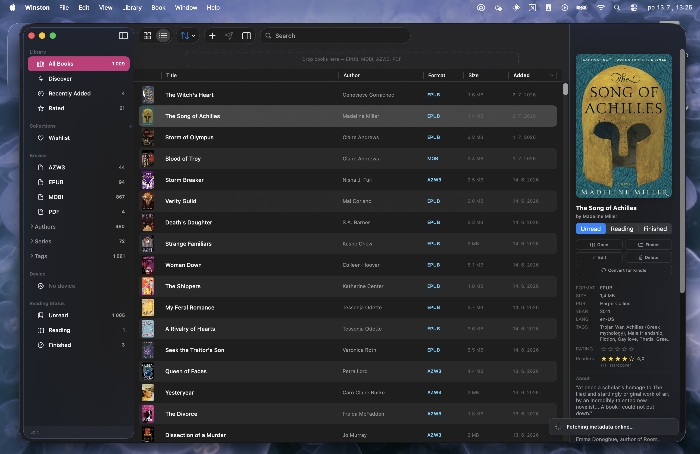
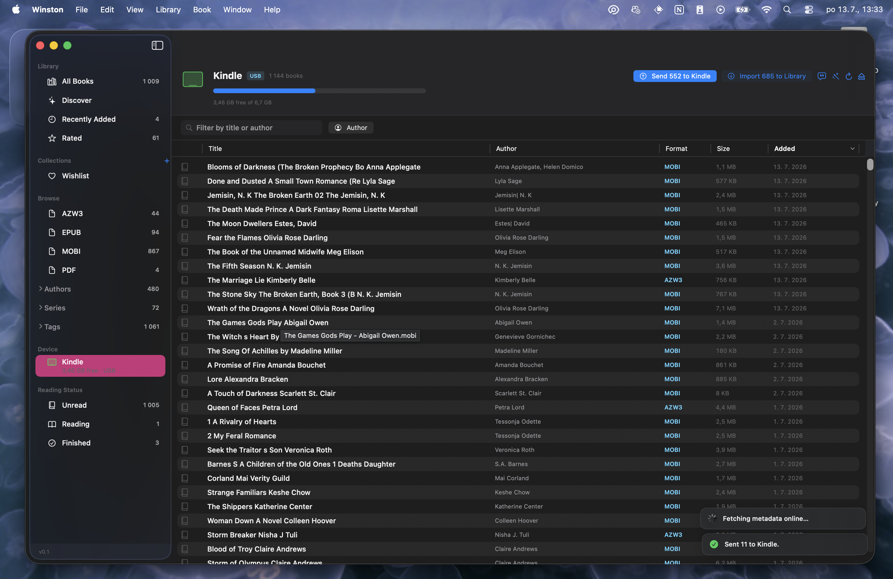
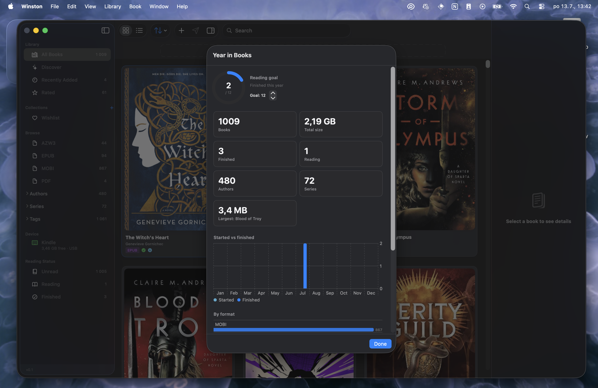
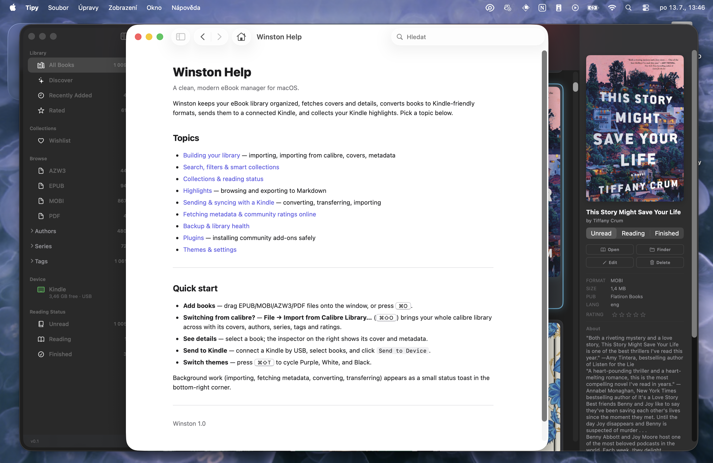

<div align="center">


# Winston

### *Two plus two still make four.* <sup>[?](https://en.wikipedia.org/wiki/2_%2B_2_%3D_5 "Freedom is the freedom to say that two plus two make four. (Winston Smith, Nineteen Eighty-Four)")</sup>

**Your books, on your Mac, on your Kindle.**

<sub>Native macOS · offline by default · one cable to Kindle</sub>

[Download](https://github.com/Aletheie/Winston/releases) · [What's new in 0.2](docs/releases/v0.2.md) · [What it does](#what-it-does) · [Build it](#build-from-source)

<p>


</p>

https://github.com/user-attachments/assets/488cb698-cd61-4d0a-9fb2-f569d8ae6b86
</div>

> [!IMPORTANT]
> Winston is **early access**. I use it for my own library, but it is still 0.x: parts will change and several planned features are not finished yet. If something breaks, [tell me](https://github.com/Aletheie/Winston/issues).

## Not another Calibre

Winston is a native Mac app for managing an ebook library and getting books onto a Kindle. Library management, conversion, covers, device cleanup and highlights are all part of the same workflow. It stays offline until you enable an online feature. Calibre is only an optional fallback for formats Winston does not yet convert natively.

Winston models **works, editions and files** separately. Two translations of Dune can belong to the same work, one edition can keep EPUB and Kindle-ready copies together, and replacing a broken file does not create another book.

## What it does

### Library

- Import EPUB, MOBI, AZW3, PDF, TXT and HTML by dragging them in, choosing files, watching a folder, or bringing over an existing Calibre library with its metadata and covers.
- **Review Import** inspects batches and anything suspicious before it touches the library. You see duplicates, DRM, damaged files, metadata differences, and whether each file will become a new work, a new edition, or another format of an edition.
- Works, editions and files stay separate. Two translations can belong to one work, while an EPUB and its Kindle-ready copy stay with the same edition. Matching suggestions wait for your approval.
- Grid and table views, field search, filters, collections, rule-based smart shelves, reading status, Kindle-presence filtering, keyboard selection and bulk editing.
- Search inside local EPUB, PDF, TXT and HTML files. The full-text index stays on this Mac and only rebuilds books whose contents changed.
- Add a book you own on paper even when there is no digital file. Physical-only entries stay out of conversion and Kindle actions.
- **Metadata Cleanup**, **Book Doctor** and **Library Integrity** find fixable metadata, damaged book files, missing assets and inconsistent catalog relationships. Safe repairs are separated from decisions that need you.
- Automatic catalog-and-cover backups include a browsable **Library Time Machine**. Compare a snapshot with today and restore one book's metadata, cover, or full catalog record without replacing its ebook file.

### Reading

- Reading history, statistics and a yearly goal. Goodreads, StoryGraph and Hardcover CSV exports can be reviewed and imported without creating duplicate reading cycles.
- **What Should I Read Today?** recommends from books you already own, taking length, language, mood, reading state and series order into account, and tells you why it picked each one.
- Series pages collect the editions you own, reading progress and missing Hardcover volumes. An optional Updates inbox checks those series for newly released books.
- Kindle highlights and notes become searchable records attached to their books and export as one Markdown file per title.

### Conversion

- Built-in EPUB to MOBI conversion, written in Swift. No Calibre process and no bundled conversion binary.
- Conversion preserves the original file and stores the output as another format of the same edition; converting again refreshes that generated copy, and replacing the source invalidates older generated copies before the next Kindle send.
- TXT, HTML and PDF use the same native pipeline. Calibre is optional for AZW3 and other formats.
- Splits Czech and other accented text at valid Unicode boundaries, embeds the selected cover, and writes the trailer records Kindle needs for indexing.
- Runs conversion off the main thread. Byte-level golden tests cover the MOBI writer.

### Kindle

- Older Kindles are detected as USB drives. An MTP backend for newer models is implemented but still needs real-hardware testing.
- **Review Sync Plan** previews additions, refreshed conversions, cover repairs and optional removals. Each Kindle can keep its own local sync profile.
- Transfers convert when needed, copy the book and home-screen thumbnail, clean up macOS sidecar files, report each outcome, and can resume work whose result could not be verified. Nothing is silently retried when delivery is uncertain.
- Send a selection or a whole series; Winston skips DRM-protected and already-present books and preserves series order. Use the explicit eject control afterward so a USB-drive Kindle can reindex.
- Copy books from the device into **Review Import**, remove device copies without touching the library, and turn `My Clippings.txt` into structured highlights and notes.

### Discovery

- [Hardcover](https://hardcover.app) integration matches the series you own, shows missing volumes and powers optional new-release checks.
- **Discover** browses by genre or search. Results can be saved to a wishlist, with links to your preferred bookstore or library catalog.
- **Catalogs** searches and browses OPDS 1 and OPDS 2 sources. Winston includes Project Gutenberg, Standard Ebooks, Unglue.it and a Wikisource matched to its English or Czech language; public and password-protected custom catalogs can be added in Settings.
- Catalog results keep their editions, formats, prices and acquisition types visible. Free compatible files go through **Review Import**; borrow, buy, sample and subscription links open at their source.
- All network features stay off until you enable them in Settings.

### Plugins

- Plain JavaScript plugins run in per-session, killable JavaScriptCore worker processes and live in `~/Library/Application Support/Winston/Plugins/`.
- Each manifest declares permissions, which the user approves in Settings. Consent is tied to the complete bundle digest; plugins have no direct filesystem or network access.
- Plugins start disabled. A timeout, resource-limit violation, or five uncaught errors quarantines one; its logs remain available in Settings.
- [Example plugins](docs/example-plugin) · [API reference](docs/PluginAPI.md) · [Writing guide](docs/WritingPlugins.md)

### macOS integration

- Quick Look previews for MOBI and AZW3 in Finder.
- Standard menus and keyboard shortcuts.
- Three themes, including the retro terminal theme, plus an app-wide font setting.
- English and Czech localization, a built-in Help book, and adaptations for Reduce Motion, Reduce Transparency, Increase Contrast and Larger Text.
- A **Review & Operations** page keeps actionable results from imports, bulk edits, repairs and Kindle work. Interrupted file transactions and a corrupted library store have explicit recovery paths instead of disappearing or entering a crash loop.

## Screenshots

<div align="center">

<table>
<tr>
<td width="50%"><br><sub><b>Table view.</b> Sort, filter, edit in bulk.</sub></td>
<td width="50%"><br><sub><b>Book detail.</b> Metadata, cover, reading status.</sub></td>
</tr>
<tr>
<td width="50%"><br><sub><b>Kindle.</b> Convert and send in one action.</sub></td>
<td width="50%"><br><sub><b>Discover.</b> Find new books, fill the gaps in your series.</sub></td>
</tr>
<tr>
<td width="50%"><br><sub><b>Statistics.</b> What your library is made of.</sub></td>
<td width="50%"><br><sub><b>The manual.</b> A real Help book, right in the Help menu.</sub></td>
</tr>
</table>

<table>
<tr>
<td width="33%"><br><sub><b>Purple.</b></sub></td>
<td width="33%"><br><sub><b>White.</b></sub></td>
<td width="33%"><br><sub><b>Black.</b></sub></td>
</tr>
</table>

</div>

## Where it's going

Completed:

- [x] **Works and editions:** separate works, editions and files, with multiple formats per edition.
- [x] **Series watch:** release notifications for series already in the library.

Near term:

- [ ] Notarized releases
- [ ] Automatic updates (not currently included; reintroduce only with a complete signed feed and release process)
- [ ] Native AZW3 output
- [ ] MTP verified on a current Kindle
- [ ] Layered app icon with the full glass treatment

Longer term:

- [ ] **Translation plugin:** optional AI-assisted book translation, starting with English and Czech
- [ ] **Import inbox:** preview changes before import, with one-click undo
- [ ] **Metadata provenance:** store the source of each value and lock hand-edited fields
- [ ] **Highlight remapping:** carry highlights over when an EPUB is replaced

## Install

**Requirements:** macOS 26.4 or newer and Apple Silicon. Calibre is optional and only needed for formats Winston cannot convert itself.

1. Download the DMG from [Releases](https://github.com/Aletheie/Winston/releases).
2. If you are updating 0.1, quit Winston and make a backup of `~/Library/Application Support/Winston` first.
3. Open the DMG and drag `Winston.app` to Applications. Choose **Replace** when macOS asks.
4. On first launch, right-click the app and choose **Open**.

The app is signed but **not notarized yet**, so the last step is currently required once. Version 0.2 upgrades the local catalog on first launch. Do not open that upgraded catalog with 0.1 again; restore the backup first if you need to roll back.

## Build from source

```bash
brew install libmtp libusb tuist   # libmtp talks to newer Kindles
git clone https://github.com/Aletheie/Winston.git
cd Winston
tuist generate                     # the .xcodeproj is generated, not committed
open Winston.xcworkspace
```

Build and install a release directly into `/Applications`:

```bash
./Scripts/install-app.sh
```

The script uses your Apple Development identity. An ad hoc signature cannot load the bundled `libmtp` under the hardened runtime.

Tests:

```bash
xcodebuild test -workspace Winston.xcworkspace -scheme Winston -only-testing:WinstonTests
```

The migration suite includes an anonymized catalog created by the public 0.1 build and verifies that its books, metadata, collections, highlights, wishlist, reading state and files survive the 0.2 schema upgrade and backfill.

## The Kindle part, explained

Three details matter when sideloading:

- A Kindle does not read a raw EPUB. Winston converts it to MOBI natively or to AZW3 through Calibre before transfer.
- A sideloaded book appears after the device reindexes. After a transfer, use Winston’s explicit eject control; transfers do not eject automatically. If eject fails, Winston reports the error and keeps the device connected so you can retry or close busy files.
- The home screen cover comes from the file itself. Winston embeds the cover selected in the library.

If a stubborn Kindle still refuses a converted MOBI: `defaults write cz.annajung.Winston preferKindleAZW3 -bool YES` switches every transfer to AZW3. Needs Calibre.

Verified on a Paperwhite 11th generation.

## Known limits

- **MTP still needs real-hardware verification.** The path for newer Kindles is implemented; the USB-drive path used by older models is proven.
- **No App Store, no iCloud sync.** Raw USB access means the sandbox is off, which rules out both. Your backups are plain files you can copy.
- **Not notarized yet**, hence the right click on first launch.
- **No automatic updater.** Install newer releases manually; automatic updates must be introduced later as a complete signed-feed project.
- **No Intel Macs.** The libmtp build Winston links against is Apple Silicon only.

## Tech

- Swift 6 with MainActor isolation by default
- SwiftUI and SwiftData
- JavaScriptCore in isolated plugin worker processes
- Quick Look app extension for MOBI and AZW3 previews
- `libmtp` and `libusb` for MTP devices
- [Tuist](https://tuist.dev) for project generation
- ZIPFoundation for EPUB archives
- Hardened runtime; the main app is unsandboxed for USB access, while the Quick Look extension is sandboxed
- Swift Testing unit suite, including golden byte tests for the MOBI writer (run with the command above)

`Winston/Core` contains conversion, device, metadata, persistence and plugin code. `Winston/Features` contains the SwiftUI screens.

## License

[MIT](LICENSE).

<div align="center">
<sub>Named after Winston Smith, who kept a diary the Party could not read.<br>Your library deserves the same.</sub>
</div>
